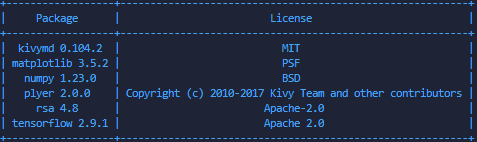

# Personal Fitness App: Human Activity Recognition Prototype

---

## Overview
This project is a prototype of a personal fitness application that uses machine learning to recognize human activities (such as sitting, walking, and running) from sensor data. The app is built with Python, Kivy, and KivyMD for the user interface, and leverages deep learning (LSTM) for activity recognition.

---

## Features
- **Human Activity Recognition**: Classifies user activity (sitting, walking, running) using sensor data and a trained LSTM model.
- **User Authentication**: Sign up, login, and user profile management.
- **Motivation Tasks**: Personalized fitness tasks based on user profile.
- **Data Visualization**: Graphs and charts to visualize activity and progress.
- **Settings and Notifications**: Customizable app settings and reminders.

---

## Getting Started

### Prerequisites
- Python 3.7+
- pip (Python package manager)

### Installation
1. **Clone the repository:**
   ```bash
   git clone https://github.com/yourusername/personal-fitness-app-human-activity-recognition-prototype.git
   cd personal-fitness-app-human-activity-recognition-prototype
   ```
2. **Install dependencies:**
   ```bash
   pip install -r requirements.txt
   ```
3. **Download or train the ML model:**
   - Run the `train_model.py` file to get the `activity_model.h5`.
   - Place your trained model file (`activity_model.h5`) in the project root directory. (A sample is provided, but you may want to retrain for your own data.)

### Running the App
```bash
python app.py
```

---

## Project Structure
```
├── app.py                      # Main Kivy app
├── app.kv                      # Main App components  
├── train_model.py              # Model training script
├── activity_model.h5           # Trained ML model
├── show_licenses.py            # Script to show package licenses
├── requirements.txt            # Python dependencies
├── README.md                   # This file
├── .gitignore                  # Git ignore rules
├── images/                     # Diagrams and screenshots
├── docs/                       # Documentation and reports
├── archive/                    # Archived/legacy files
```

---

## Screenshots
### App Screen


---

## LSTM Model Architecture
This diagram shows the architecture of the LSTM neural network used for human activity recognition in this project:


---

## Class Diagram
The `class_diagram.png` file provides a UML class diagram of the main components and their relationships in the Personal Fitness App. It helps visualize the software architecture, showing the key classes (such as user management, activity recognition, and UI screens), their attributes, methods, and how they interact within the application:


---

## Documentation
- See the `docs/` folder for technical requirements, test reports, and detailed documentation.

---

## Contributing
Pull requests are welcome! For major changes, please open an issue first to discuss what you would like to change.

---

## License & Package Licenses
This project is for educational purposes. See `show_licenses.py` for license info of dependencies.

A summary of the main Python package licenses used in this project is provided in the image below:



---

## Authors
- Muhammad Suleman (main developer)

---
*This project was developed as part of an Embedded Systems case study at DIT.*
